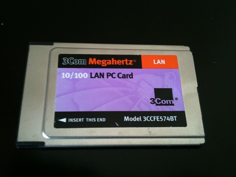
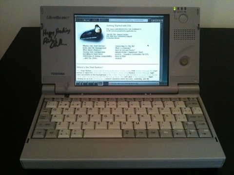

# Damn Small Linux on a Libretto 50CT

In about 2004 a friend from college got into his hands a series of
[Toshiba Libretto 50CT](http://resource.toshiba-europe.com/europe/computers/flyers/libretto/libretto_50_e.pdf).
They all came with Windows 95 pre installed, and we wiped them out
and installed Debian with a 2.2 kernel from floppies, with much pain because of
the unsupported disk drive. I remember it being so difficult that I
don't even want to write about it. But it booted and was able to
run Vim, Links, and connect to the internet. Enough for a
network-enabled typewriter.

I got Richard Stallman to sign mine while it was running GNU/Linux,
but when I bought a regular laptop I stopped using it because,
well, it is too old, and its keyboard is too tiny to type
comfortably with it.

[](https://github.com/carlesfe/dsl-libretto50ct/raw/master/img/libretto_closed.jpg)

The Libretto, closed. It is a tiny machine, a wonderful piece of
engineering.

Around 2012 I found it inside a box at home, working
perfectly, with a battery life of a bit less than an hour—which is incredible for
a 12+ year old machine— and
[DR-DOS](http://en.wikipedia.org/wiki/DR-DOS) installed. I can't
remember why I did that, but
[Golden Axe](http://en.wikipedia.org/wiki/Golden_Axe) was also
installed, so there's a hint.

I decided to install a modern Linux and, at least, store it on a
working condition to give some justice to Stallman's signature.

There are some tutorials available on the net, but none of them
covered 100% of the hardware support for my machine. Most of them
are also outdated, and refer to distributions that don't exist,
don't have any support or are about unusable nowadays. However, I
took many hints from those tutorials, and I will reference them
accordingly.

## Hardware

This laptop has a 75 MHz —actually, mine reports 74 MHz— with
**24** MB of RAM, which is an upgrade from the original 16 MB which
are usually bundled. The screen is 640x480, and if you choose a
higher resolution, instead of scaling the image, it only displays
the upper-leftmost 640x480 pixels, leaving the bottom and rightmost
part of the area out of sight.

The mouse device is emulated as a PS/2, and physically is a
"clitoris"-like pointing device. You know what I mean. 
Working with the X windows is a pain in the neck because the
location of the mouse and buttons isn't very ergonomic, and clicking on a button makes
the whole screen move on its hinges. 

Next to the mouse there is a
speaker which is similar in quality to those of a modern
smartphone.

This device doesn't have any extension port other than a dock
connector for a dock I don't have, and a 16-bit PCMCIA slot, which
you will need for the network card. It doesn't have a COM port or
anything like that, which is understandable, given the size of the
case.

It does have an Infrared device, which is quite slow and useless,
but for its time it was as good as wireless could get. The other
holes correspond to the power adapter and the reset button next to
the PCMCIA, big enough to be able to reset the laptop with a
regular pen.

For the full specifications, please refer to
[the official leaflet](http://resource.toshiba-europe.com/europe/computers/flyers/libretto/libretto_50_e.pdf).

[](https://github.com/carlesfe/dsl-libretto50ct/raw/master/img/libretto.jpg)

The setup I will be using: the Libretto, and a 3Com 16-bit PCMCIA
Ethernet card


## Choosing a Linux distribution

I wanted to find some modern, low-demanding software, not
unsupported versions of Debian or RedHat. As you might have
expected by this page's title, I chose
[Damn Small Linux](http://www.damnsmalllinux.org/) (DSL).

I was very lucky to find that my machine had been upgraded to 24 MB
of RAM. Apparently, even low-end distros have difficulties booting
a regular kernel with 16 MB. I didn't want to tune or recompile the
kernel on a 75-MHz machine, so I had to do some tricks.

In order to decide on a distro, I tried to set some goals up:

1.  Discard modern distributions which require at least 256 MB of
    RAM. In fact, discard anything that doesn't work with 24 MB of RAM
2.  Try to avoid old versions of current distros (i.e. Debian
    Woody) because the ISOs and the packages might not be mirrored
    anymore and are difficult to be found.
3.  Use a distro which self-configures kernel modules on boot,
    because I will be installing from a Virtual Machine and the
    hardware will change between reboots. Recompiling the kernel is
    totally out of the picture.
4.  Kernel 2.4 if possible, to make both the audio and the Ethernet
    work
5.  As easy to configure as possible. I want to finish this in a
    few hours... [Update from 2015: Yeah, right...]

I found myself with these contenders,
[Damn Small Linux](http://www.damnsmalllinux.org/),
[Puppy Linux](http://puppylinux.org/) and
[Tiny Core Linux](http://distro.ibiblio.org/tinycorelinux/welcome.html).

DSL v4 was the chosen one for many reasons. First, the default
software choice is a good compromise and finely tuned for
low performing machines. The installation seemed the easiest
of the three, and—very important—worked flawlessly inside
VirtualBox. The documentation is very extensive and, as a slightly
old distro, there are lots of manuals and forum posts with
solutions to common problems.

There is also the fact that DSL is based on Knoppix, so it detected
my hardware perfectly, didn't have to tweak the PCMCIA, and only
had to configure the audio manually because the I/O ports were not
the standard ones. This was a huge aid for me. PCMCIA Internet
working out of the box is something I hadn't even imagined to
have.

However, the decision also came with a few drawbacks. DSL has its
own "package manager", which only works from X and can't uninstall
packages. 

`apt-get` can be enabled, but it might break packages already installed with MyDSL.
Furthermore, those packages tend to disappear on a reboot for some reason. I'm
still unsure on whether to use apt-get with MyDSL. We will not be using it.

The ACPI doesn't work, but I don't know whether it's the kernel or the Libretto's
fault.

My biggest fear, however, is that most of the packages are old and
might have security issues. However, as this will not be my main
machine, and it won't run a browser with JavaScript enabled, I'm
not very worried.

**Why didn't I choose Tiny Core?** because it didn't boot on a
VirtualBox machine with 24 MB of RAM. It would have been my first
choice, because it is better maintained than DSL. A real pity.

**And what about Puppy?** The LiveCD is great but the installation
instructions were too complicated for me. I really didn't want to
spend that much time configuring everything. It is maybe too modern
(based on Slackware 13.37 with Kernel 3.1.10) and I doubt the
Libretto could have handled its kernel.

## Installation

*Please note: I will assume that you have some experience with Linux, partitioning, and installing stuff from a console.*

### Strategy

There are two alternatives: use floppy disks or physically remove
the drive and set up a VM. Years ago, I went the first path,
because I had the floppy disk drive. Since I don't have it
anymore, I found
[an awesome tutorial](http://davissharonforest.tripod.com/DebianLinux31onToshibaLibretto50.htm)
which suggested to physically remove the drive from the Libretto,
attach it to a 2.5" IDE to USB adaptor, and install the system from
another computer. Check out his pictures for details on how to
remove the drive. My machine is in a bad condition
(broken hinges, cracks all over the case, stuck screws) and I had
to break some plastics and metal parts to access the drive.

So, we will use another Linux computer, which you probably already
have, and set up a virtual machine inside VirtualBox. Then, we will
remove the Libretto's physical HDD and attach it via USB to your
computer, using an adapter. The DSL CD image and the new /dev/sd
will be mapped inside the VM.

This way we can boot and install from a CD, instead of doing
netinsts with the Debian Woody diskettes, as you will read on many
other websites. It is the fastest and painless way, and if you
don't have the floppy drive, it is the only way.

If you have the floppy drive and are wondering if it is worth to
buy the adapter, go ahead! Walk the
difficult path, install DOS, start a Linux setup from DOS, try to
make the floppy disk work, then install from diskettes with a
crappy kernel, fight with the PCMCIA driver until you are able to
use the network, and install from the net. And, should the
installation fail, start OVER AGAIN! When this happens, please send
me an email so that I can pretend that I sympathize with you but
actually laugh at your misery.

Talking seriously, I am just trying to warn you.
I tried that, I failed, then I succeeded, and not even in my
success I want even the worst of my enemies going that path. Buy it, 
then come back and follow these instructions.

### Removing the hard drive

You already have the adapter? Great! I bought
this one which worked great and allowed me to manipulate the drive from my
main computer.

[](https://github.com/carlesfe/dsl-libretto50ct/raw/master/img/ide_adapter_box.jpg)

This is the adapter in its box. It comes with an enclosure that I
didn't use to avoid overheating, and a handy screwdriver.

[](https://github.com/carlesfe/dsl-libretto50ct/raw/master/img/ide_adapter.jpg)

A close up of the IDE adapter. Don't buy a SATA one by mistake!

### Using the drive in VirtualBox

As stated before, we will use VirtualBox to make DSL think it is
running on a real machine, and that the—now USB— hard drive is the
main drive of the VM. Turns out that using a physical disk from `/dev` on
VirtualBox isn't easy to find, but the actual command is simmple.


**Please make sure that your Linux has detected the USB drive as `/dev/sdb` before proceeding or you might lose data on the wrong disk!**
If in case, use Disk Utility or check dmesg.

    VBoxManage internalcommands createrawvmdk -filename disk.vmdk -rawdisk /dev/sdb
                                                                           ^^^^^^^^  <-- check this

The command above will create a file named disk.vmdk, which is a
short plaintext file which references to `/dev/sdb`. You can now add
it to your VM using the normal VirtualBox Appliance Manager

### Partitioning

Use your main Linux box to partition the hard drive. Disk Utility
works well, but I used cfdisk.

The tutorial then notes that the last 32MB of the disk space are
used for the Libretto's hardware Hibernate feature. I followed his
partition table suggestions completely. Just in case his page is
down, do this:

-   `/dev/hda1` 738.0 MB, `ext2` (ext3 is slower, but more secure),
    mounted as `/`
-   `/dev/hda2` 40.3 MB, `swap`
-   A remaining free space of 37.2 MB. Don't worry if the figure is
    slightly higher or lower due to rounding.

### Installing DSL

Now go ahead, and download the ISO image. I used the Release
Candidate
[4.11.rc1](http://distro.ibiblio.org/damnsmall/release_candidate/dsl-4.11.rc1.iso)
and it didn't give me any problems

Set up a new VM with 24 MB of RAM, use the ISO as the CD drive, and
the disk.vmdk as the hard drive. Then boot.

If everything goes well, you will be shown the desktop. Now, in
order to install, I have adapted the
[official instructions](http://www.damnsmalllinux.org/wiki/installing_to_the_hard_disk.html)

    sudo -s
    swapoff -a
    mkswap /dev/hda2 ## Considering that you followed the partition scheme in the tutorial
    swapon /dev/hda2
    dsl-hdinstall

Follow the setup assistant from there. I chose Grub instead of LILO
for the bootloader, and it worked. The network also works out of
the box, so I didn't need to apply any modifications in
`/etc/default/pcmcia` as stated in David's tutorial.

Now disconnect the USB adapter, remove the disk, put it back in the
Libretto, and boot. You should be prompted with either the console
login or a X desktop, depending on your setup.

## Network

I have a PCMCIA 16-bit 5V 3Com Ethernet adapter and just recently
acquired a wireless Orinoco Gold card, 16b 5V too, one of the few
known to work with this Libretto model, albeit only in WEP-mode.

This Libretto
only accepts Type II PCMCIA, so it is very difficult to find a
Linux 2.4 compatible, WPA-capable wifi card. Please let me know if
you managed to get WPA wifi working!

Here are some pictures, as a reference.

[](https://github.com/carlesfe/dsl-libretto50ct/raw/master/img/3com.jpg)

The 3Com card, front

[](https://github.com/carlesfe/dsl-libretto50ct/raw/master/img/3com_back.jpg)

The 3Com card, back. Note the "PC card" icon with the technical
specs.

The Knoppix core of DSL detected my Ethernet card, configured it
with DHCP, and it talked instantly to my home router. Woohoo, it's
on the Internet! I actually didn't need to do anything, compared to
the hell I suffered with the Debian setup some years ago.

### Wireless

[](https://github.com/carlesfe/dsl-libretto50ct/raw/master/img/orinoco.jpg)

[](https://github.com/carlesfe/dsl-libretto50ct/raw/master/img/orinoco_back.jpg)

Again, thanks to the Knoppix core, the Libretto automatically detected the PCMCIA card, loaded the 
`orinoco` kernel module, and the card was ready to use.

First, prepare your wireless router to work with WEP. It is **highly discouraged** to do so, 
because it is a big security hole. Fortunately I had a spare router that I can use only for the
Libretto and will turn it off after playing with it.

My recommended setup for the router is:

- Hide the ESSID
- Filter by MAC address
- Use 802.11b with auto channel
- Use a 128-bit ASCII WEP key

I tuned `/opt/eth0.sh` to run the `iwconfig` commands. Add this just below the `#!/bin/bash` line:

```bash
iwconfig eth0 essid ESSID_NAME
iwconfig eth0 key open s:WEPKEY
iwconfig eth0 mode managed
sleep 1
```

If you WEP key is hex and not ASCII, omit the `s:` part before it.

Wait for a few seconds, and when `iwconfig` reports a correct Access Point, you're on the internet.
Congratulations!

Since the 50CT has very low specs, Firefox starts swapping like crazy. The best commandline browser
is `links2` and I recommend `dillo` if you run X.

[](https://github.com/carlesfe/dsl-libretto50ct/raw/master/img/github.jpg)

Look ma, no cables!

## Sound

[This other tutorial](http://ta.twi.tudelft.nl/DV/Staff/Lemmens/libretto70ct.html)
points out some tricks to use all of the Libretto's capabilities. I
didn't try most of them, but since I couldn't play any music, I
went ahead and probed the `opl3sa2` driver. At first, it didn't work,
because the I/O parameters on my card weren't the same than on that
page.

[](img/bios.jpg)

This is my main BIOS configuration

[](img/bios_audio.jpg)

A detail of the audio section.
From top to bottom, the values correspond to the following module
parameters

-   mss_io
-   not used
-   not used
-   irq
-   dma
-   dma2
-   io
-   mpu_io

This means that we will load the module with the following
parameters. Remember to check your BIOS and use the correct ones,
or modprobe will fail

    modprobe opl3sa2 io=0x370 mss_io=0x530 mpu_io=0x330 irq=7 dma=1 dma2=0

*Note: to access the Libretto BIOS, reboot or reset it, and press &lt;ESC&gt; during or just after the memory check*

Finally, the Pentium 75 CPU is able to play most mp3 files, but you
will need to compile your own [mpg123](http://www.mpg123.de/). DSL
comes with `mpg321`, but the audio isn't fluid and for some reason
only `mpg123` is able to decode mp3 in realtime. Running it from a
console instead of an X session also helps, though the main
bottleneck is the CPU, not the RAM

## ACPI/APM/Battery

I only managed to get APM working. Playing with the Grub boot
options there is no way to enable ACPI.

[This blog post](http://www.notanon.com/programming/libretto-110ct-linux-acpi-tweaks-idlerunner-py-screen-blanker/2011/11/25/)
has some pointers on how to install the Toshiba experimental ACPI
driver, but as I didn't want to recompile the kernel, I couldn't
use it. If you feel strong enough, use the same Virtual Machine
that you used for the DSL install and recompile it there, with the
power of a current computer.

The `toshiba` kernel module loads correctly (`/proc/toshiba`), but not
`toshiba_acpi` (`/dev/toshiba`). Not a big deal for me, but if you
managed to get it working without recompiling the Knoppix kernel,
please let me know.

The Libretto does some power management by hardware (screen
blanking, hibernation), and this is enough for me. However, to get
the system to actually power off after a shutdown, edit the
`/boot/grub/menu.lst` and change the parameter `noapm` to `apm=on`
`apm=power-off`

`torsmo`, DSL's dashboard, usually manages to get my battery status,
but I didn't investigate further.

## Performance tricks

Here are some generic tips on how to save some RAM and CPU cycles

-   **Enable DMA** - For some reason, DSL disables DMA by default.
    To enable it, edit the Grub config file `/boot/grub/menu.lst` and
    change the boot parameter `nodma` for `dma`. You will then see a boot
    message saying that DMA has been enabled for `/dev/hda`
-   **Disable ttys** - Edit `/etc/inittab` and disable all consoles
    but one. Instead, run a GNU `screen` session to get terminal
    multiplexing.
-   **No X** - Disable the automatic X session that is launched on
    login. You might need to edit the `.bashrc` or the `.bash_profile`
    files. Comment out the `startx` command.
-   **GNU tools** - With those bytes we saved, use the DSL menu
    option "Upgrade to GNU tools" to replace the very basic BusyBox
    shell with the regular GNU tools.
-   **Fix the date** - Use MyDSL to install `ntpdate` and run it when
    coming back from hibernation, since the date will probably be incorrect:
    `ntpdate ntp.apple.com`

Currently my setup takes the following resources:

-   Used memory with X running: 10 MB
-   Used memory without X running: 3 MB
-   Used disk space: 290 MB

Not bad, right? 3 MB of RAM on boot and a full functioning X taking
only 7 MB more. That leaves a whooping 14 MB for applications!

As the pointing device is not that great, I usually run a single
tty with a `screen` session for terminal multiplexing, and do most of
my work on the terminal. X is only needed for viewing PDFs or
images, and that's a perfectly suitable task for that computer.

## Final words

I find it amazing that a laptop from early 2001 can
still hold about an hour of battery, its drive is still spinning,
and that it overall works. DSL gave it a new life, and though it is
tedious to use a cable or WEP to connect to the internet, it is a
functioning UNIX system, with audio and a decent mobile typewriter.
Yes, the keyboard is small and uncomfortable, but this thing fits
in any bag. Why, by 1990s standards, it would "fit in your
pocket"!

There is plenty of information out there on installing Linux on a
Libretto, but at the time of writing this article, most of articles
are about 7-10 years old. I hope that it can be useful for somebody
who, like me, found this machine at the bottom of a drawer and
might want to play with it a little, install a current Linux and
maybe give it to your kids or use it as a second laptop.

I wouldn't use it as a server, since it has little memory to run a
server daemon, the disk and fan are noisy,
and keeping it on 24/7 would burn the machine. If
you want a cheap server, go for an old Mac Mini and install the
latest Debian there. The Libretto is a ultra portable laptop and,
if yours still holds some battery charge, is a nice toy to write
stuff on or browse the simple internet.

DSL is highly customizable, and there is plenty of documentation
out there. The default software is great, and searching the net you
will find current software which is suitable for low memory
devices. You will find yourself with a machine capable of reading and
writing emails, displaying images, playing music, and more.

The only sites it can't browse are those which use Flash or are
heavy on JavaScript. Well, the modern web, Gmail, Facebook,
Twitter... but if you try to use the mobile versions you might get
a nice surprise. You can try to use the Firefox version bundled in
DSL but I wouldn't recommend that, it's too slow.

Feel free to contact me if there is any mistake on the tutorial or
if you have some contribution, for example, a command to make it
run with WPA, or if you managed to make the ACPI work.

[](https://github.com/carlesfe/dsl-libretto50ct/raw/master/img/libretto_x.jpg)

The Libretto running an X session

Thanks for reading!

* * * * *

CC by-nc 2012-2015, Carlos Fenollosa. Contact:
[twitter](http://twitter.com/cfenollosa) or
[mail](mailto:carlos.fenollosa@gmail.com)
